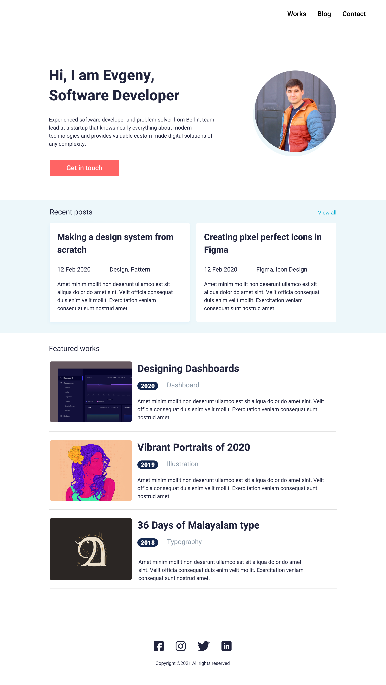

## Getting started

you need to compile sass to css for example in vscode which is not included here.

To compile `sass` into `css` run the following commands

```shell
yarn install
yarn run sass
```

Start the server on demand

```shell
npx http-server
```

## Screenshot

There is reference screenshot


